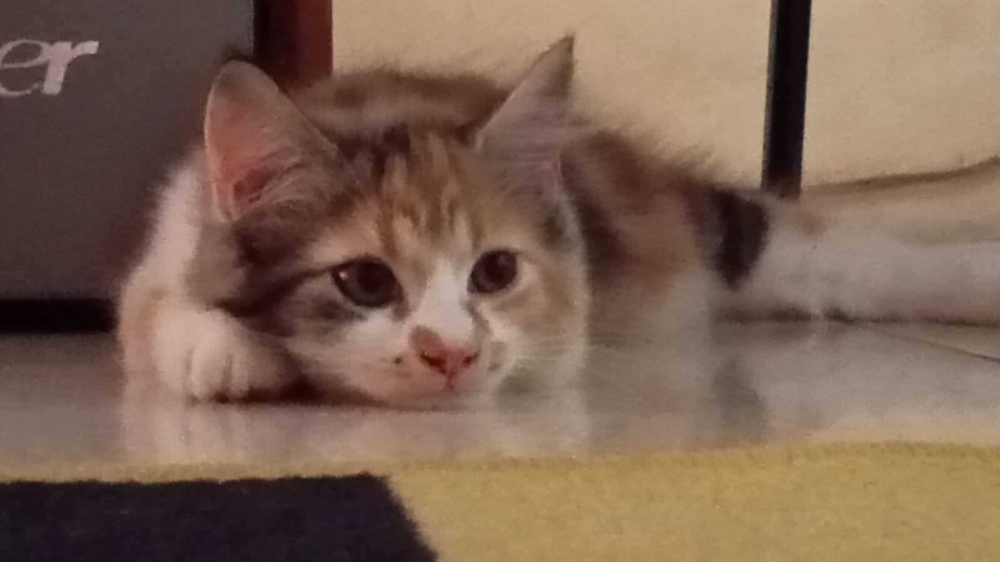
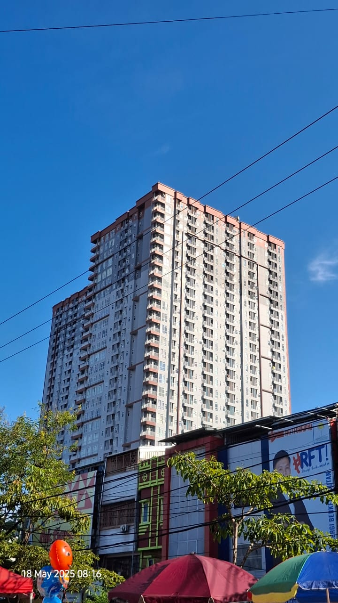
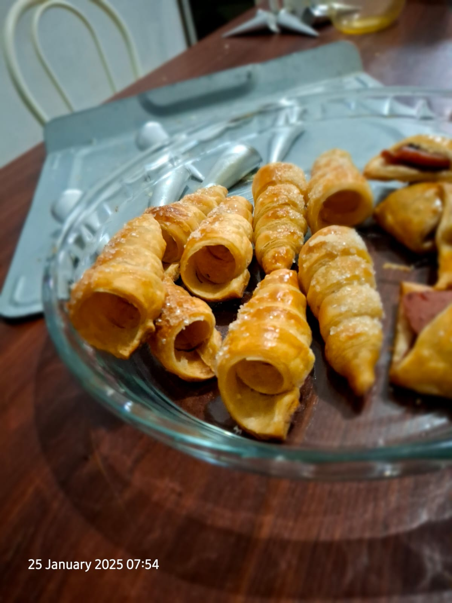
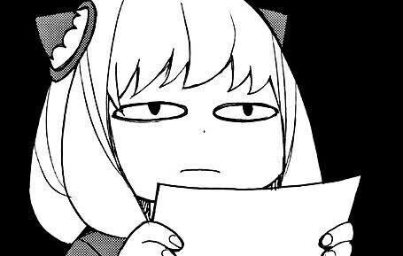

# Analisa CSS pada Pembaruan File portodiri dan penambahan halaman baru

## file css portodiri2.html
Ditambahkan tampilan baru untuk css Bar Navigasi
``` 
    .navbar {
      display: flex;
      justify-content: space-between;
      align-items: center;
      padding: 1rem 2rem;
      background-color: #19183B;
      color: white;
      position: sticky;
      top: 0;
      z-index: 1000;
    }
```
Blok kode ini akan mengatur gaya tampilan untuk class yang menggunakan selector '.navbar', dengan detail tampilan 'flex' yang akan membuat elemen didalam navbar tersusun secara horizontal, lalu untuk ```justify-content``` digunakan untuk mengatur spasi rata kiri-kanan. lalu untuk ```align-items``` memosisikan item agar berada ditengah secara vertikal, lalu untuk jarak antar konten elemen dan garis border sebesar 1rem untuk atas-bawah, dan 2rem untuk kiri-kanan. Blok kode ini juga akan mengatur latar warna dengan warna ```#19183B```, warna teks putih dengan sifat navbar sticky yang akan membuatnya terus muncul meski halaman di gulir kebawah. posisi top:0 agar posisi navbar berada di posisi paling atas dan terakhir ```z-index``` sebesar 1000 agar navbar tidak tertutup oleh elemen lain ketika layar di gulir.
```
    .logo {
      font-size: 1.3rem;
      font-weight: bold;
    }
```
blok kode diatas akan mengatur tampilan dari navbar, ```.logo``` akan mengatur ukuran font elemen '.logo' sekitar 20 pixel, dengan ketebalan teks 'bold'.
```
    .nav-links {
      list-style: none;
      display: flex;
      gap: 1.5rem;
      margin: 0;
      padding: 0;
    }
```
 lalu untuk ```.nav-links``` selector ini akan mengatur gaya tampilan dengan detail pertama-tama akan menghilangkan tanda bawaan tag ```<ul>```, biasanya bullet, selanjutnya mengubah ```<ul>``` menjadi flex container, sehingga item ```<li>``` berjejer kesamping, lalu selector ini akan memberikan jarak antar tautan 'know more about me' dan 'contact' sekitar 24pixel lalu menghilangkan margin dan padding bawaan tag ```<ul>```

```
    .nav-links a {
      text-decoration: none;
      color: white;
      font-weight: 500;
      transition: color 0.3s;
    }
```
Pada bagian ```.nav-links a```, akan mengatur tampilan dengan detail; text-decoration: none menghilangkan garis bawah standar pada link, lalu color: white membuat teks berwarna putih agar kontras dengan latar belakang navbar. Selanjutnya, font-weight: 500 memberi ketebalan sedang agar teks terlihat jelas, dan transition: color 0.3s menambahkan efek transisi halus ketika warna berubah saat hover.
```
    .nav-links a:hover {
      color: #FFD700;
    }
```
Blok ```.nav-links a:hover``` mengatur tampilan link ketika kursor diarahkan ke atasnya. Warna teks berubah menjadi kuning keemasan (#FFD700) sehingga memberikan efek interaktif dan menandai bahwa tautan tersebut bisa diklik.
```
    .container {
      display: flex;
      min-height: 100vh;
    }
```
Terakhir, blok ```.container``` berfungsi untuk membungkus keseluruhan isi halaman setelah navbar. display: flex membuat tata letaknya fleksibel dan memungkinkan pembagian ruang antara sidebar dan konten utama. Sementara itu, min-height: 100vh memastikan tinggi kontainer minimal sama dengan tinggi layar penuh, sehingga struktur halaman terlihat proporsional.


Seluruh tambahan baru css ini diaplikasikan pada blok kode berikut 
```
<nav class="navbar">
    <div class="logo">MyPorto</div>
    <ul class="nav-links">
      <li><a href="aboutme.html">Know More About Me</a></li>
      <li><a href="kontak.html">Contact</a></li>
    </ul>
</nav>
```
```
      <li><a href="aboutme.html">Know More About Me</a></li>
      <li><a href="kontak.html">Contact</a></li>
```
bagian jika di tekan pada navbar akan membawa user berindah halaman, ke ```aboutme.html``` atau ke ```kontak.html```

## Analisa css file aboutme.html dan kontak.html
```
   .container {
      display: flex;
      min-height: 100vh;
    }
```
class selector ```.container``` akan mengatur tampilan dari elemen yang menggunakan atribut class=container, dengan detail tampilan rata kiri kanan, dengan tinggi sebesar 100vh, 100% dari tinggi layar browser. 
```
    .cards {
        display: flex;
        padding-left: 15em;
        padding-right: 15em;
    }
```
class selector ```.cards``` akan mengatur tampilan dari elemen yang menggunakan atribut class=cards, dengan detail tampilan rata kiri-kanan, lalu memberi jarak konten dan border kiri sebesar 10em, begitu juga dengan kanan 10em
```
 h3{
      text-align: center;
    }
```
blok kode ini akan mengatur tampilan dari elemen yang menggunakan h3, dengan detail susunan teks rata tengah
```
  section {
      background: #ffffff;
      padding: 1.5rem;
      border-radius: 10px;
      margin: 2rem auto;
      box-shadow: 0 2px 5px rgba(0,0,0,0.05);
      width: 250px;
      text-align: center; 
    }

```
selector ```section``` akan mengatur tampilan yang ada didalamnya dengan detail latar warna putih, jarak antara konten dan border sebesar 1.5rem (24pixel) lalu mengatur ketajaman sudut melengkung sebesar 10pixel, selanjutnya mengatur margin sebesar 20 pixel di semua sisi antar elemen lain. pada  ```box-shadow: 0 2px 5px rgba(0,0,0,0.05);``` baris ini akan memberikan bayangan halus dibawah container, lebar dari container adalah 250pixel, dengan pengaturan teks rata tengah.
```
    section img {
      width: 150px;
      height: 150px;
      border-radius: 10%;
      margin-bottom: 1rem;
      object-fit: cover;
    }
```
selector ```section img``` akan mengatur tampilan yang ada didalamnya dengan detail tampilan lebar 150 pixel, tinggi 150 pixel, lalu sudut nya dibuat melengkung sebesar 10pixel dan memberi jarak bagian bawah sebesar 1rem, dengan model gambar yang dimasukkan 'cover'.
```
    section h2 {
      font-size: 1.2rem;
      margin-bottom: 0.8rem;
      color: #333;
    }
```
selector ini akan mengatur tampilan didalamnya, dengan detail ukuran teks sebesar 1.2rem, jarak margin (sisi) bawah 0.8rem, dengan warna teks ```#333```
```
   section p {
      font-size: 0.9rem;
      color: #555;
      margin-bottom: 1rem;
    }
```
blok kode ini akan mengatur tampilan dari tag ```<p>``` didalam section dengan ukuran teks 0.9rem, berwarna ```#555```, dengan jarak margin (sisi) bawah sebesar 1rem.
```
  section a {
      padding: 0.5rem 1rem;
      background: #3396D3;
      color: white;
      border-radius: 5px;
      text-decoration: none;
      font-weight: 500;
      transition: background 0.3s;
    }
```
blok okde ini akan mengatur tampilan didalamnya dengan detail, jarak antar konten dan border sebesar 0.5rem atas bawah, dan 1rem kiri kanan. Berlatar warna ``` #3396D3;```, warna teks adalah biru. Bentuk dari sudut kotak akan melengkung sebesar 5pixel, selector ini juga akan menghilangkan garis bawah bawaan dari tag ```<a>``` dan ketebalan teks akan diatur sebesar 500. transition itu akan membuat latar warna berubah secara halus secepat 0.3 detik ketika di-hover.

```
    section a:hover {
      background: #2577a6;
    }
```
blok kode ini sendiri akan mengatur selector ```section a:hover``` dengan latar warna #2577a6;

seluruh css diatas untuk file aboutme.html dan kontak.html diaplikasikan pada blok kode dibawah ini

### aboutme.html
```
<div class="cards">
  <section>
     
    <h2>Doraaa</h2>
    <p>Entitas Kucing Hobi Berak</p>
    <a href="pictkucing.html">Lihat disini</a>
  </section>
  <section>
    
    <h2>Sight Seeing</h2>
    <p>Jepretan Random</p>
    <a href="pictPeman.html">Lihat disini</a>
  </section>
  <section>
    
    <h2>Makanan</h2>
    <p>Jepretan Makanan Random</p>
    <a href="pictMakanan.html">Lihat disini</a>
  </section>
  <section>
    
    <h2>Meme Kinda Lucu</h2>
    <p>Meme pilihan 😏</p>
    <a href="pictMeme.html">Lihat disini</a>
  </section>
  </div>
```
### kontak.html
```
<body>
  <h1>Mari Terhubung!</h1>
<div class="cards">
  <section>
     
    <h2>Instagram</h2>
    <p>Terhubung ke Insta!</p>
    <a href="https://www.instagram.com/reyadeh_1/">Disini!</a>
  </section>
  <section>
    
    <h2>Github</h2>
    <p>Terhubung Ke Github!</p>
    <a href="https://github.com/EsKopikkk">Disini!</a>
  </section>
  <section>
    
    <h2>Email</h2>
    <p>Terhubung ke Email!</p>
    <a href="mailto:riyadhi377@gmail.com">Disini!</a>
  </section>
  </div>

</body>
```

## Analisa css file pictkucing.html

Analisa CSS untuk file ini berlaku sama untuk file pictmakanan.htmml, pictPeman.html dan pictMeme.html.
```
    body {
      margin: 0;
      font-family: 'Poppins', sans-serif;
      background-color: #EFF5D2;
      color: #333;
    }
```
blok kode diatas akan mengatur gaya tampilan dari tag ```<body>```, dengan detail margin diatur ke 0, jenis teks yang digunakan yaitu 'Poppins' berwarna #333, dengan latar warna #EFF5D2;. 
```
    h1 {
      text-align: center;
      margin: 2rem 0;
    }
```
blok kode ini akan mengatur gaya tampilan dari tag ```<h>```, dengan detail teks rata tengah, margin sebesar 2rem (32pixel)
```
    .gallery {
      display: flex;
      flex-wrap: wrap;
      justify-content: center;
      gap: 1.5rem;
      padding: 0 2rem 3rem;
    }
```
class selector ini akan mengatur gaya tampilan dengan detail; tampilan rata kiri kanan, baris ```flez-wrap: wrap``` akan mengatur elemen agar dapat tampil menurun jika layar dikecilkan (window), dengan tampilan utama elemen rata tengah, jarak masing-masing elemen diatur sebesar 1.5rem (24pixel) dengan padding atas 0 pixel, kiri-kanan sebesar 32 pixel, dan bawah sebesar 48pixel.
```
    .gallery img {
      width: 250px;
      height: 250px;
      object-fit: cover;
      border-radius: 10px;
      transition: transform 0.3s, box-shadow 0.3s;
      cursor: pointer;
    }
```
selanjutnya untuk class selector diatas ini, akan mengatur gaya tampilan gambar, dengan detail lebar 250 pixel, tinggi 250 pixel, gambar diatur dengan 'cover' agar rapi dan tidak terpotong banyak lalu baris ini```transition: transform 0.3s, box-shadow 0.3s;``` akan mengatur seberapa lama transisi hover terjadi ketika kursor mengarah keatas gambar.
```
    .gallery img:hover {
      transform: translateY(-10px) scale(1.05);
      box-shadow: 0 8px 20px rgba(0,0,0,0.2);
    }
```
untuk class selector diatas, akan mengatur gaya tampilan dari hover, efek nya secara singkat akan membuat gambar yang berada dibawah kursor akan timbul keatas sebesar 10 pixel dan zoom-in sebesar 5% dengan bayangan dibawahnya.