# Analisis Hasil Praktikum, Laporan ke-5

## 1tagScript.html
```
<HTML>
<HEAD>
    <TITLE> contoh JavaScript</TITLE>
    <script language="JavaScript">
        document.write("Program JavaSript Aku di kepala"); 
    </script>
</HEAD>

<BODY>
    <script language="JavaScript">
        document.write("Program JavaSript Aku di body"); 
    </script>
</BODY>
</HTML>
```
Blok kode diatas menggunakan tag ```<script>``` pada bagian ```<head>``` dan ```<body>```. Pada bagian head, program menampilkan tulisan 'Program JavaSript Aku di kepala' sementara pada bagian body, program menampilkan tulisan 'Program JavaSript Aku di body'
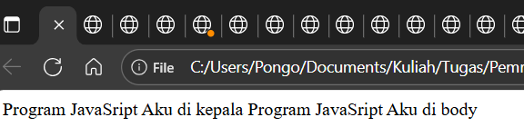

## 1ufileEksternal.html
```<SCRIPT LANGUAGE=Javascript SRC="contohFileEksternal.js"> </SCRIPT>```
baris ini digunakan untuk memanggil atau membuka file bertipe '.js' (JavaScript). Penempatan pemanggilnya berada pada tag pertama ```<script>```SRC="contohFileEksternal.js", diatas ia membuka file contohFileEksternal.js.

## 2eventTert.html
```
<!DOCTYPE html>
<html>
    <head>
        <title>Belajar JavaScript : Kenalan dengan Event</title>
    </head>
    <body>
        <h1>Kenalan dengan event JavaScript</h1>
        <h2>Pemrograman Web Event oneclick</h2>
        <button onclick="tampilkan_nama()">klik sini</button>
        
        <div id="hasil"></div>

        <script>
            function tampilkan_nama(){
                document.getElementById("hasil").innerHTML="<h3> Nama saya Muhammad Riyadhy Al-Haadiy";
            }
        </script>
    </body>
</html>
```
Teks html dan Javascript diatas menggunakan ```<button onclick="tampilkan_nama()">klik sini</button>```, fungsi dari baris ini adalah jika di analogikan sebagai pemanggil fungsi, fungsi disini yaiti ```tampilkan_nama()```, yang akan mencetak teks "Nama saya Muhammad Riyadhy Al-Haadiy"
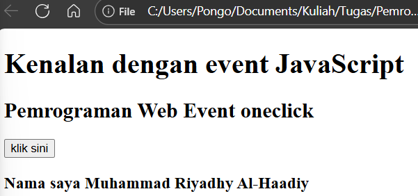

## 3contohSederhana.html
```
<html>
    <head>
        <title>contoh sederhana JavaScript</title>
    </head>
    <body>
        <script language="JavaScript">
            document.write("Selamat Belajar Angkatan 2019","<br>");
            document.write("JavaScript Pemrograman Web TEKNIK KOMPUTER");
        </script>
    </body>
</html>
```
Teks html & script diatas, mencetak 2 kalimat menggunakan JavaScript pada bagian body, keduanya ditampilkan; ```Selamat Belajar Angkatan 2019``` dan ```JavaScript Pemrograman Web TEKNIK KOMPUTER```
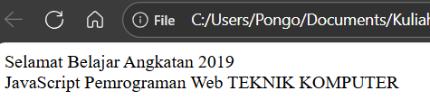
## 4memasukkanData.html
```
<html>
    <head>
        <title>Masukkan Data</title>
    </head>
    <body>
        <script language = "JavaScript">
            var nama =prompt("Tell me your name")
            document.write("hello! " + nama);
        </script>
    </body>
</html>
```
Teks diatas menggunakan JavaScript untuk meminta user memasukkan data dan menampilkannya. Diatas, alurnya program meminta data dengan menampilkan 'Tell me your name' melalui ```var nama =prompt("Tell me your name")```, selanjutnya setelah user mengisi data, program akan menampilkan tulisan 'hello!' dan data yang dimasukkan. contohnya 'hello! mary'.
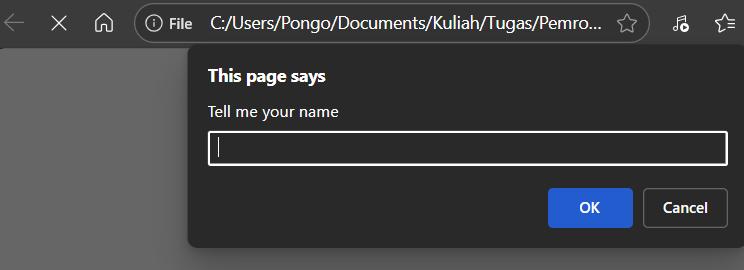
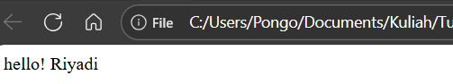
## 5jendelaPeringatan.html dan 5kjendelaPeringatan.html
```
<html>
    <head>
        <title>Alert Box</title>
    </head>
    <body>
        <script language="JavaScript">
            window.alert("Yakin meninggalkan halaman ini?")
        </script>
    </body>
</html>
```
Teks diatas menggunakan JavaScript untuk menampilkan jendela peringatan melalui ```window.alert("Yakin meninggalkan halaman ini?")```, peringatan seperti ini umum ditemukan ketika seseorang telah mengisi data tertentu atau ingin meninggalkan sebuah halaman web.
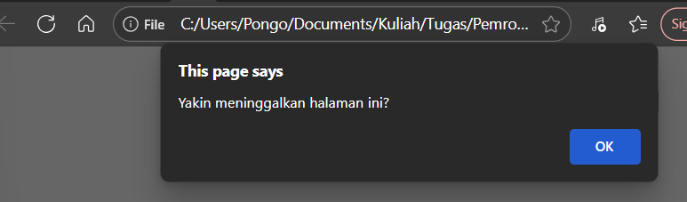
```
<html>
    <head>
        <title>Konfirmasi</title>
    </head>
    <body>
        <script language="JavaScript">
            var jawaban = window.confirm("Apakah anda yakin?");
            document.write("Jawaban Anda adalah "+jawaban);
        </script>
    </body>

</html>
```
Teks diatas mempunyai kerja yang sama dengan teks sebelumnya, namun teks ini akan meminta pengguna untuk mengkonfirmasi tindakan/action yang akan ditampilkannya dengan menampilkan tulisan 'apakah anda yakin' melalui ```window.confirm```, dan menampilkan teks setelah pengguna melakukan konfirmasi tindakan melalui ``` document.write("Jawaban Anda adalah "+jawaban);```
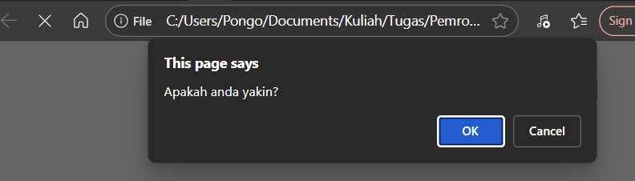
## 6deklaVariabel.html
```
<script language="JavaScript">
    var VariabelKu;
    var VariabelKu2=3;
    VariabelKu = 1234;
    document.write(VariabelKu*VariabelKu2);
</script>
```
Teks pada file ini menggunakan JavaScript untuk mendeklarasikan variabel, dengan awalan ```var```, diatas dideklarasikan variabel 'VariabelKu', lalu diinisialisasi nilainya dengan '1234', pada variabel kedua 'VariabelKu2' ia diinisialisasi nilainya senilai '3', lalu diakhir terdapat penggunaan operator ```*```, untuk menampilkan hasil kali dari ```VariabelKu``` dan ```VariabelKu2```.
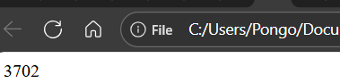
## 7lokalGlobal.html vs 7lokalGlobal2.html

### 7lokalGlobal.html
```
<script language="JavaScript">
    var a = 12;
    var b = 4;

    function Perkalian_Dengan2(b) {
        a = b * 2;
        return a;

    }
    document.write("Dua kali dari ", b, " adalah ", Perkalian_Dengan2(b));
    document.write("Nilai dari a adalah ", a);
</script>
```
### 7lokalGlobal2.html
```
<script language="JavaScript">
    var a = 12;
    var b = 4;
    function Perkalian_Dengan2(b){
        var a = b*2;
        return a;
    }
    document.write("Dua Kali dari ",b," adalah ", Perkalian_Dengan2(b));
    document.write("Nilai dari a adalah ", a);
</script>
```
Secara sekilas, kedua teks diatas terlihat mirip, namun keduanya berbeda hanya pada satu baris. Pada ```7lokalGlobal.html```, ia melakukan operasi perkalian melalui fungsi dengan mendeklarasikan ```var a = 12``` dan ```var b = 4```, selanjutnya didalam fungsi dilakukan operasi perkalian b * 2 yang nilainya disimpan pada variabel a. lalu menampilkan teks "Dua Kali dari ",b," adalah ", dan Nilai dari a adalah ", a outputnya menampilkan terlihat nilai dari variabel a adalah 8.

<br>
Sementara pada ```7lokalGlobal2.html```, ia sama sama melakukan operasi perkalian pada variabel a, namun perbedaannya variabel a dideklarasikan 2 kali, pertama pada awal script (global), lalu didalam fungsi yang menjadikan variabel a didalamnya kedalam global, lebih jelasnya pada baris ini ```var a = b*2;```. Maka terlihat jelas perbedaan hasil outputnya disini
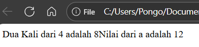


## 8konversiTipedata.html
```
<html>
    <head>
        <title>Konversi Bilangan</title>
    </head>
    <body>
        <script language="JavaScript">
            var a =parseInt("27");
            document.write("1. "+ a +"<br>");
            a = parseInt("27.5");
            document.write("2. "+ a +"<br>");
            var a =parseInt("27A");
            document.write("3. "+ a +"<br>");
            a = parseInt("A27.5");
            document.write("4. "+ a +"<br>");
            var b =parseFloat("27");
            document.write("5. "+ b +"<br>");
                b = parseFloat("27.5");
            document.write("6. "+ b +"<br>");
            var b = parseFloat("27A");
            document.write("7. "+ b +"<br>");
                b =parseFloat("A27.5");
            document.write("8. "+ b +"<br>");
        </script>
    </body>
</html>
```
Teks html ini menngkonversi sejumlah angka kedalam tipe data yang sesuai, diatas terdapat baris seperti ```parseInt()``` dan ```parseFloat``` 
```
            var a =parseInt("27");
            document.write("1. "+ a +"<br>");
            a = parseInt("27.5");
            document.write("2. "+ a +"<br>");
            var a =parseInt("27A");
            document.write("3. "+ a +"<br>");
            a = parseInt("A27.5");
            document.write("4. "+ a +"<br>");
```
blok kode ini menggunakan ```parseInt()``` untuk mengkonversi angka kedalam bentuk tipe data Integer, contohnya mengkonversi 27.5 bertipe data string ke bentuk 27 bertipe data integer, tiap inisialisasi variabel a diatas, nilainya diatur kedalam tipe data yang berbeda dengan integer, fungsi parseInt() mengkonversi nya kedalam tipe data integer.

```
            var b =parseFloat("27");
            document.write("5. "+ b +"<br>");
                b = parseFloat("27.5");
            document.write("6. "+ b +"<br>");
            var b = parseFloat("27A");
            document.write("7. "+ b +"<br>");
                b =parseFloat("A27.5");
            document.write("8. "+ b +"<br>");
```
sementara blok kode diatas ini menggunakan ```parseFloat()``` untuk mengkonversi angka kedalam tipe data Float, contohnya mengkonversi 27A yang bertipe data string ke bentuk 27 bertipe data float, tiap inisialisasi variabel b diatas, nilainya diatur kedalam tipe data yang berbeda dengan integer, fungsi parseFloat() pada blok kode ini mengubah tipe data string kedalam bentuk float.
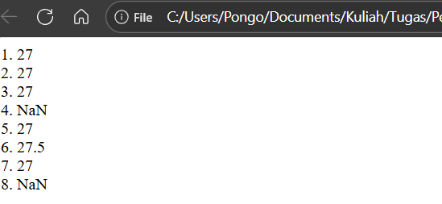

## 9operArit.html
```
<HTML>

<HEAD>
    <TITLE>Operasi Matematika</TITLE>
</HEAD>

<BODY>
    <SCRIPT LANGUAGE="JavaScript">
        document.write("2 + 3 = " + (2 + 3) ); 
        document.write("<BR>"); 
        document.write("20 - 3 = " + (20 - 3) ); 
        document.write("<BR>"); 
        document.write("20* 3 = " + (2 * 3) ); 
        document.write("<BR>"); 
        document.write("40 / 3 = " + (40 / 3) ); 
        document.write("<BR>"); 
    </SCRIPT>
</BODY>

</HTML>
```
Teks html diatas menggunakan JavaScript untuk melakukan operasi aritmatika, diantaranya tambah(+), kurang(-), kali(*) dan bagi(/), dengan tiap melakukan operasi akan membuat baris baru sesuai dengan output yang telah diatur diatas.
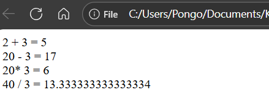
## 10operLogik.html
```
<HTML>
<HEAD>
    <TITLE>Operator ?</TITLE>
</HEAD>
<BODY>
    <SCRIPT LANGUAGE="JavaScript">
        <!-- 
        var nilai = prompt("Nilai (0-100): ", 0); 
        var hasil = (nilai >= 60) ? "Lulus" : "Tidak Lulus"; 
        document.write("Hasil: " + hasil); 
        //-->
    </SCRIPT>
</BODY>
</HTML>
```
Teks html diatas menggunakan JavaScript untuk melakukan operasi logika, melalui baris ```var hasil = (nilai >= 60) ? "Lulus" : "Tidak Lulus";``` dimana akan mengatur hasil output dimana jika variabel nilai memiliki nilai sama dengan atau lebih besar dari 60 akan menampilkan teks 'lulus', jika dibawahnya maka akan menampilkan output 'tidak lulus'.
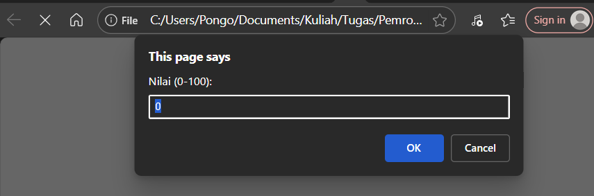
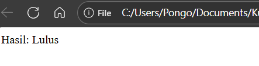

## a1Tugasmandiri.html
```
<!DOCTYPE html>
<html>
<head>
  <title>Konversi Tipe Data</title>
</head>
<body>
  <script>
    var a = Number("123"); 
    document.write("1. String '123' konversi pakai Number() : " + a + "<br>");

    var b = parseInt("123.45"); 
    document.write("2. String '123.45' konversi ke Int : " + b + "<br>");

    var c = parseFloat("123.45");
    document.write("3. String '123.45' konversi ke Float : " + c + "<br>");

    var num = 456;
    var str1 = String(num);
    document.write("4. Angka 456 didalam String : " + str1 + "<br>");

    var bool = true;
    var str2 = String(bool);
    document.write("5. Boolean true didalam String : " + str2 + "<br>");

    var d = Boolean(0);
    document.write("6. Angka 0 dalam Boolean : " + d + "<br>");

    var e = Boolean(123);
    document.write("7. Angka 123 dalam Boolean : " + e + "<br>");

    var f = Boolean("");
    document.write("8. String kosong didalam petik '' dalam Boolean : " + f + "<br>");

    var g = Boolean("Halo");
    document.write("9. String 'Halo' dalam Boolean : " + g + "<br>");
  </script>
</body>
</html>
```
Teks html ini mengkonversi beberapa nilai tipe data (Number-angka, String dan Boolean) ke dalam tipe data (Number, Integer, Float, String, dan Boolean).
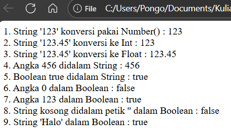
## a2Tugasmandiri.html
```
<!DOCTYPE html>
<html>

<head>
  <title>Tipe Data dalam Array</title>
</head>

<body>
  <script>
    var data = [123, 45.67, "Halo Dunia", true, false];

    document.write("Isi Array:<br>");
    for (var i = 0; i < data.length; i++) {
      document.write((i + 1) + ". " + data[i] + " (tipe: " + typeof data[i] + ")<br>");
    }
  </script>
</body>

</html>
```
Teks html ini menggunakan JavaScript untuk memasukkan nilai kedalam variabel data (array), nilai didalam array memiliki tipe data yang berbeda bersusun dari iterasi 0-5 (123, 45.67, "Halo Dunia", true, false). Program ini akan mencetak teks "isi Array:", dilengkapi perulangan berbasis kondisi dimulai i=0, jika nilai variabel i lebih kecil dari jumlah iterasi didalam array, maka akan dilakukan penambahan nilai (increment) hingga kondisi terpenuhi. Perulangan for akan terus mencetak sebanyak jumlah iterasi didalam array dan menampilkan isi array sesuai iterasinya melalui data[i].
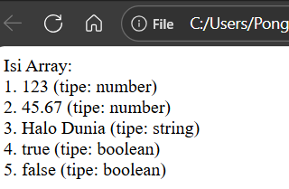
## 3Tugasmandiri.html
```
<!DOCTYPE html>
<html>

<head>
    <title>Kalkulator</title>
</head>

<body>

    <h2>Kalkulator</h2>
    <input type="text" id="display" disabled><br><br>


    <button onclick="addValue('7')">7</button>
    <button onclick="addValue('8')">8</button>
    <button onclick="addValue('9')">9</button>
    <button onclick="addValue('/')">/</button><br>

    <button onclick="addValue('4')">4</button>
    <button onclick="addValue('5')">5</button>
    <button onclick="addValue('6')">6</button>
    <button onclick="addValue('*')">*</button><br>

    <button onclick="addValue('1')">1</button>
    <button onclick="addValue('2')">2</button>
    <button onclick="addValue('3')">3</button>
    <button onclick="addValue('-')">-</button><br>

    <button onclick="addValue('0')">0</button>
    <button onclick="addValue('.')">.</button>
    <button onclick="calculate()">=</button>
    <button onclick="addValue('+')">+</button><br><br>

    <button onclick="clearDisplay()">C</button>

    <script>
        function addValue(value) {
            document.getElementById("display").value += value;
        }

        function calculate() {
            try {
                let result = eval(document.getElementById("display").value);
                document.getElementById("display").value = result;
            } catch (error) {
                document.getElementById("display").value = "Error";
            }
        }

        function clearDisplay() {
            document.getElementById("display").value = "";
        }
    </script>

</body>

</html>
```
Pada teks html ini, dicoba untuk membuat sebuah kalkulator sederhana, mengandalkan tag button ```<button onclick="addValue('-')">-</button><br>```, dimana untuk tiap tiap tombol pada kalkulator seperti angka 0-9, seluruh operator aritmatika (+,-,/,*,=), serta tombol c(clear). Lalu diakhir menambahkan logika fungsi addValue berparameter value, untuk menambahkan nilai. Lalu fungsi calculate untuk melakukan logika aritmatika, yang jika memasukkan nilai yang tidak dapat di proses akan menampilkan error.

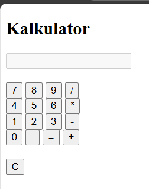
## 4Tugasmandiri.html
```
<!DOCTYPE html>
<html>

<body>

    <h2>Perhitungan Bangun Ruang</h2>

    <script>
    
        let sisi = 5;
        let volumeKubus = sisi * sisi * sisi;
        document.write("1. Volume Kubus (sisi = " + sisi + "): " + volumeKubus + "<br>");
        
        let panjang = 10;
        let lebar = 4;
        let tinggi = 6;
        let volumeBalok = panjang * lebar * tinggi;
        document.write("2. Volume Balok (p=" + panjang + ", l=" + lebar + ", t=" + tinggi + "): " + volumeBalok + "<br>");

        let jari = 7;
        let tinggiTabung = 10;
        let volumeTabung = Math.PI * jari * jari * tinggiTabung;
        document.write("3. Volume Tabung (r=" + jari + ", t=" + tinggiTabung + "): " + volumeTabung.toFixed(2) + "<br>");
    </script>

</body>

</html>
```
Teks html diatas menggunakan JavaScript untuk melakukan operasi perhitungan luas bangun datar; kubus, persegi panjang dan tabung. 
```
        let sisi = 5;
        let volumeKubus = sisi * sisi * sisi;
        document.write("1. Volume Kubus (sisi = " + sisi + "): " + volumeKubus + "<br>");
``` 
Blok kode ini melakukan perhitungan luas Kubus, dengan variabel volumeKubus akan diinisialisasi hasil kali dari sisi*sisi*sisi, dan mencetak nya.
```
        let panjang = 10;
        let lebar = 4;
        let tinggi = 6;
        let volumeBalok = panjang * lebar * tinggi;
        document.write("2. Volume Balok (p=" + panjang + ", l=" + lebar + ", t=" + tinggi + "): " + volumeBalok + "<br>");
```
Blok kode ini melakukan perhitungan luas persegi panjang, dengan mendeklarasikan variabel ```let panjang = 10;, let lebar = 4; let tinggi = 6;```, dan variabel ```let volumeBalok = panjang * lebar * tinggi;``` untuk menghitung hasil kali dari variabel panjang, lebar dan tinggi. lalu mencetak hasilnya melalui baris ini
```
document.write("2. Volume Balok (p=" + panjang + ", l=" + lebar + ", t=" + tinggi + "): " + volumeBalok + "<br>");
```
```
        let jari = 7;
        let tinggiTabung = 10;
        let volumeTabung = Math.PI * jari * jari * tinggiTabung;
        document.write("3. Volume Tabung (r=" + jari + ", t=" + tinggiTabung + "): " + volumeTabung.toFixed(2) + "<br>");
```
Blok kode ini melakukan perhitungan luas Tabung, dengan mendeklarasikan variabel ```let jari = 7; let tinggiTabung = 10;``` dan variabel ```let volumeTabung = Math.PI * jari * jari * tinggiTabung;``` untuk menghitung hasil kali dari PI, variabel jari dan tinggiTabung dan mencetak hasilnya melalui baris ini ```
document.write("3. Volume Tabung (r=" + jari + ", t=" + tinggiTabung + "): " + volumeTabung.toFixed(2) + "<br>");```
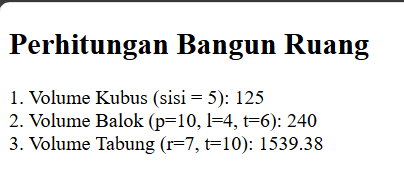